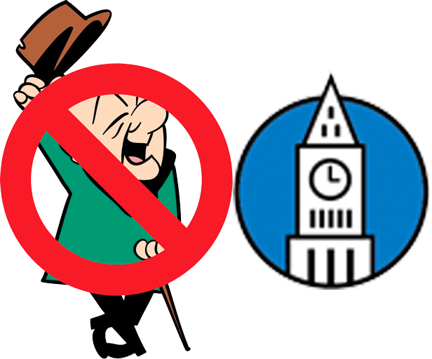
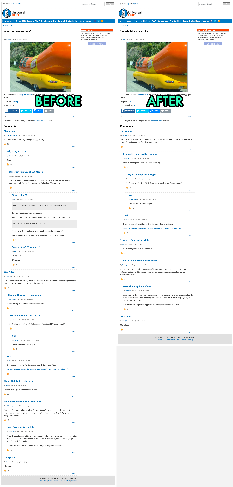

# No Magoo

## No Magoo
This is a Chrome extension that hides comments from the user MeMagooForYou and any replies to those comments on the [universalhub.com](https://universalhub.com) website..

## Installation
### Store
As soon as it's approved, you should be able to grab it from the [Chrome Store](https://chrome.google.com/webstore/search/no%20magoo).

### Download
1. Download these files into an empty directory _somewhere_ on your computer.
2. Go to `chrome://extensions`.
3. Toggle the "Developer mode" switch in the upper right to on.
4. Click on the "Load unpacked" button in the upper left.
5. Find the directory from Step 1.
6. Click on select.
7. [Enjoy](https://www.universalhub.com/crime/20210908/man-tries-hold-brigham-circle-supermarket-fails).

Check out your browser console for a count of how many comment threads have been removed.

## Why??
Some people love magoo. I hate his stupid comments like the Family Circus. The only thing worse than a magoo comment is
the inevitable thread that follows:

    I HATE you magoo!
        Oh! I love magoo!
            Magoo sucks! Why don't you ban him, Gaffin?
                ...

This plugin gets rid of it all.
